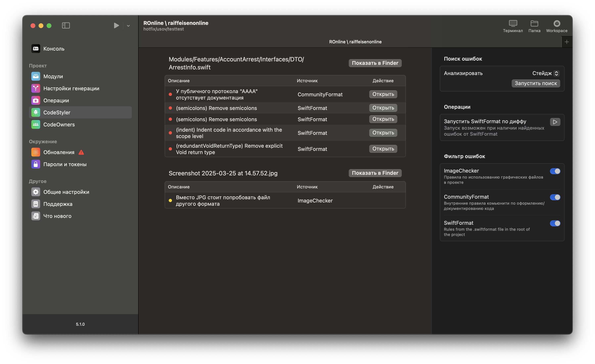

# CodeStyler

Use CodeStyler to ensure your developers follow code style conventions for code, files, and merge requests.

The screenshot below shows the result of CodeStyler integrated into the RaifMagic application.



## Key Features

- Diff-based file checks: Developers will receive messages only for newly added or changed code and files.
- Local diff analysis support.
- Support for diff and merge request analysis.
- Ability to create custom rules that extend CodeStyler’s capabilities.
- Ability to pass data between modules (incomplete in original text, may refer to internal data sharing between checkers/components).

## Usage

### Installation

The library is distributed as an SPM package, including two products:

- `CodeStyler` – the core service with CodeStyler functionality.
- `CodeStylerSwiftUI` – the UI for working with CodeStyler. You can implement your own UI or use the views provided in this product.

You can integrate CodeStyler into any GUI or CLI application. To use CodeStyler in your project, add this SPM package and select the appropriate targets based on your needs.

### Running Analysis

First, import CodeStyler in the file where you plan to use it.

```swift
import CodeStyler
```

Create the necessary dependencies:

```swift
// Logger
final class Logger: ICodeStylerLogger {
	func log(message: String) {
		print(message)
	}
	
	func log(error: String) {
		print(error)
	}
}

// Shell command executor
let executor = CommandExecutor(...)
```

Then, create the service to work with CodeStyler:

```swift
let service = CodeStylerService(commandExecutor: executor, logger: logger)
```

#### Local Analysis

##### Creating a Configuration

To perform local analysis, create a `CodeStylerService.LocalConfiguration` configuration:

```swift
let configuration = CodeStylerService.LocalConfiguration(
	filesDiffCheckers: [], // diff checkers
	filesDiffSource: .combined, // diff detection strategy
	excludeFilesWithNameContaints: [] // file name substrings to exclude from diff
)
```

The `filesDiffCheckers` parameter accepts an array of checkers, each of which can detect its own code/file style violations. CodeStyler provides several built-in checkers as examples for implementing your own:

- **SwiftFormatDiffChecker**: Integrates swiftformat for code formatting checks (runs formatting in check mode only, without modifying files).
- **ImageChecker**: Checks image files against rules, e.g., suggests replacing `.jpg` with `.png` to reduce app size.
- **RegexCheckerService**: Allows custom regex-based style checks, e.g., ensuring `public` protocols are documented.

These examples can be used as a base for implementing your own project-specific checkers.

##### Running the Analysis

Call `analyze(localConfiguration:)` to run the analysis. It returns an array of messages describing found issues.

```swift
let messages = try await service.analyze(localConfiguration: configuration, projectPath: "/absolute_path_to_project")
```

#### CI Analysis

To run CodeStyler in CI, you need to build a separate CLI tool that runs in one of your pipeline jobs. If style violations are found, you can post them as merge request comments and fail the job to prevent merging into `master/main`.

##### Creating a Configuration

CI usage is similar to local, but you can also analyze the merge request itself.

Create a configuration:

```swift
let configuration = GitlabConfiguration(
	filesDiffCheckers: [], // diff checkers
	filesDiffSource: .combined, // diff detection strategy
	excludeFilesWithNameContaints: [], // excluded filename patterns
	mergeRequest: GitlabMergeRequest(...), // merge request to analyze
	mergeRequestCheckers: [] // merge request checkers
)
```

The `filesDiffCheckers` parameter is the same as for local usage.

The `mergeRequest` parameter accepts a `GitlabMergeRequest` object. You can create and populate it manually or use `GitlabAPIService` from the `RaifMagicCore` library to load merge request data.

The `mergeRequestCheckers` parameter accepts checkers for merge requests. CodeStyler provides a built-in checker that you can use or extend:

- **MergeRequestChecker**: Validates the merge request title (e.g., checks for forbidden characters like Cyrillic).

##### Running the Analysis

Call `analyze(gitlabConfiguration:)` to run the analysis. It returns an array of messages describing found issues.

```swift
let messages = try await service.analyze(gitlabConfiguration: configuration, projectPath: "/absolute_path_to_project")
```

### UI

As mentioned, the `CodeStylerSwiftUI` product includes a SwiftUI-based interface for CodeStyler. To use it in your project, import the product and use the `CodeStylerView` struct in your SwiftUI interface.